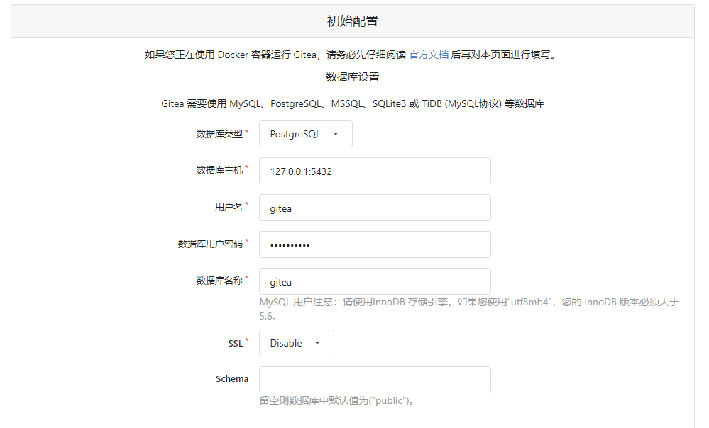

<Boxx/>

## 系统环境

- 操作系统：Ubuntu Server 20.04 LTS 64bit
- Gitea版本：1.6.1

## 安装
::: tip
官方安装文档：<https://docs.gitea.io/zh-cn/install-from-binary/>
:::

在此使用的是二进制安装，也可使用官方文档中的其他安装方式

所有下载均包括 SQLite, MySQL 和 PostgreSQL 的支持，同时所有资源均已嵌入到可执行程序中，这一点和老版本有所不同。 基于二进制的安装非常简单，只要从 [下载页面](https://dl.gitea.io/gitea) 选择对应平台，拷贝下载URL，执行以下命令即可
```shell script
# 用 wget 下载 gitea 到 /usr/local/bin/ 目录下
sudo wget -O /usr/local/bin/gitea https://dl.gitea.io/gitea/1.16.1/gitea-1.16.1-linux-amd64

# 进入 /usr/local/bin 文件夹
cd /usr/local/bin

# 添加 gitea 可执行权限
sudo chmod +x gitea
```

## 测试
安装完成后，你将会获得 `gitea` 的二进制文件，在你复制到部署的机器之前可以先测试一下。

命令行执行完后，按住 `Ctrl + C` 可关掉程序
```shell script
./gitea web
```

## 以 Service 方式运行
执行以下命令：
```shell script
sudo vim /etc/systemd/system/gitea.service
```

接着拷贝示例代码 [gitea.service](https://gitee.com/gitea/gitea/blob/main/contrib/systemd/gitea.service) 并取消对任何需要运行在主机上的服务部分的注释，譬如 MySQL。

我这儿使用的是 `Postgresql`，所以打开了 `postgresql.service` 的注释

Postgresql 安装教程请看：[Postgresql 安装文档](./postgresql-install.md)
```shell script
[Unit]
Description=Gitea (Git with a cup of tea)
After=syslog.target
After=network.target
###
# Don't forget to add the database service dependencies
###
#
#Wants=mysql.service
#After=mysql.service
#
#Wants=mariadb.service
#After=mariadb.service
#
Wants=postgresql.service
After=postgresql.service
#
#Wants=memcached.service
#After=memcached.service
#
#Wants=redis.service
#After=redis.service
#
###
# If using socket activation for main http/s
###
#
#After=gitea.main.socket
#Requires=gitea.main.socket
#
###
# (You can also provide gitea an http fallback and/or ssh socket too)
#
# An example of /etc/systemd/system/gitea.main.socket
###
##
## [Unit]
## Description=Gitea Web Socket
## PartOf=gitea.service
##
## [Socket]
## Service=gitea.service
## ListenStream=<some_port>
## NoDelay=true
##
## [Install]
## WantedBy=sockets.target
##
###

[Service]
# Modify these two values and uncomment them if you have
# repos with lots of files and get an HTTP error 500 because
# of that
###
#LimitMEMLOCK=infinity
#LimitNOFILE=65535
RestartSec=2s
Type=simple
User=git
Group=git
WorkingDirectory=/var/lib/gitea/
# If using Unix socket: tells systemd to create the /run/gitea folder, which will contain the gitea.sock file
# (manually creating /run/gitea doesn't work, because it would not persist across reboots)
#RuntimeDirectory=gitea
ExecStart=/usr/local/bin/gitea web --config /etc/gitea/app.ini
Restart=always
Environment=USER=git HOME=/home/git GITEA_WORK_DIR=/var/lib/gitea
# If you install Git to directory prefix other than default PATH (which happens
# for example if you install other versions of Git side-to-side with
# distribution version), uncomment below line and add that prefix to PATH
# Don't forget to place git-lfs binary on the PATH below if you want to enable
# Git LFS support
#Environment=PATH=/path/to/git/bin:/bin:/sbin:/usr/bin:/usr/sbin
# If you want to bind Gitea to a port below 1024, uncomment
# the two values below, or use socket activation to pass Gitea its ports as above
###
#CapabilityBoundingSet=CAP_NET_BIND_SERVICE
#AmbientCapabilities=CAP_NET_BIND_SERVICE
###

[Install]
WantedBy=multi-user.target
```

修改 user，home 目录以及其他必须初始化参数，如果使用自定义端口，则需修改 PORT 参数，反之如果使用默认端口则需删除 -p 标记。

激活 gitea 并将它作为系统自启动服务（设置开机启动）：
```shell script
# 启动 gitea 服务
sudo systemctl enable gitea
# 运行结果
Created symlink /etc/systemd/system/multi-user.target.wants/gitea.service → /etc/systemd/system/gitea.service.
```

### 重载 daemon
重载daemon，让新的服务文件生效：
```shell script
sudo systemctl daemon-reload
```

### 开启服务
```shell script
# 打开 gitea 服务
sudo systemctl start gitea
```

### 关闭服务
```shell script
# 关闭 gitea 服务
sudo systemctl stop gitea
```

### 查看状态
```shell script
sudo systemctl status gitea
```

::: danger
**注意**：

若是无法访问，启动失败，记得创建以上（和配置页面中）所用到的文件夹并且打开权限
:::

## 配置
::: tip
默认端口是 `3000`
:::
访问网址 `ip:3000`，按照页面说明完成配置即可


