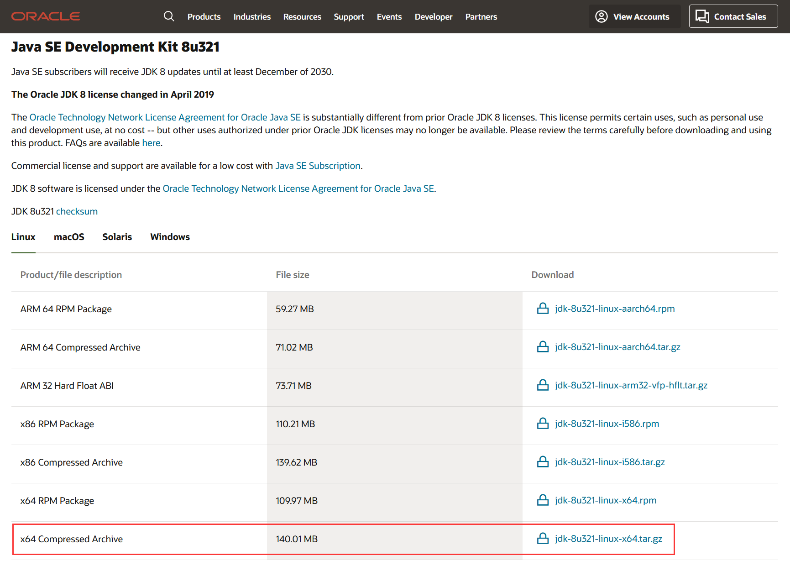
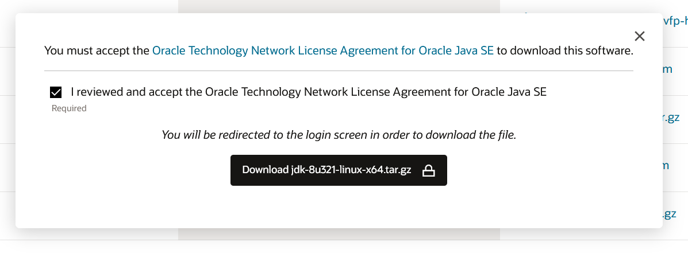

<Boxx/>

## 系统环境

- 操作系统：Ubuntu Server 20.04 LTS 64bit
- Java版本：jdk1.8

## 查看是否已安装

使用 `java -version` 命令，查看是否已经安装，如果出现 `jdk` 版本信息，则表示已经安装过 `jdk`

```shell script
lighthouse@VM-0-5-ubuntu:~$ java -version

# 若出现以下信息，则表示未安装

Command 'java' not found, but can be installed with:

apt install openjdk-11-jre-headless  # version 11.0.13+8-0ubuntu1~20.04, or
apt install default-jre              # version 2:1.11-72
apt install openjdk-13-jre-headless  # version 13.0.7+5-0ubuntu1~20.04
apt install openjdk-16-jre-headless  # version 16.0.1+9-1~20.04
apt install openjdk-17-jre-headless  # version 17.0.1+12-1~20.04
apt install openjdk-8-jre-headless   # version 8u312-b07-0ubuntu1~20.04

Ask your administrator to install one of them.
```

## 直接安装
```shell script
sudo apt-get install default-jdk
```

## 压缩包安装
### 下载

::: tip

下载方式分为直接在当前博客下载、官网下载和 `wget` 命令下载

官方网址：<https://www.oracle.com/java/technologies/downloads/>

**注意**：官网下载需要账号密码
:::

- 当前博客下载
  1. 安装包(从官网中下载的): 
     - JDK8: [jdk-8u381-linux-x64.tar.gz](http://162.14.111.130:9999/download/jdk-8u381-linux-x64.tar.gz)
     - JDK11: [jdk-11.0.20_linux-x64_bin.tar.gz](http://162.14.111.130:9999/download/jdk-11.0.20_linux-x64_bin.tar.gz)
     - JDK17: [jdk-17_linux-x64_bin.tar.gz](http://162.14.111.130:9999/download/jdk-17_linux-x64_bin.tar.gz)
     - JDK20: [jdk-20_linux-aarch64_bin.tar.gz](http://162.14.111.130:9999/download/jdk-20_linux-aarch64_bin.tar.gz)
  1. 将下载后的文件放入服务器 `/home/download` 文件夹中

- 官网下载
    1. 选择对应操作系统的版本，并点击其包名 `jdk-8u321-linux-x64.tar.gz`
        
    2. 勾选弹窗中的协议，点击 `Download jdk-8u321-linux-x64.tar.gz`
        
    3. 随后根据页面提示，输入账号密码，即可下载
       ```
       账号：2028056560@qq.com
       密码：Oracle1234
       若此账号已失效，请自行百度搜索可用的账号
       ```
        
    4. 将下载后的文件放入服务器 `/home/download` 文件夹中

- 使用 `wget` 命令下载(因为需要接受安全协议，直接输入下载地址无法下载，所以要设置header)，若不更换版本，可直接使用以下命令下载
    ::: danger
    **注意：此方法在2023年8月22日时已失效，请使用其他方式下载**
    :::
    ``` shell script
    # 进入 dowwnload 文件夹
    lighthouse@VM-0-5-ubuntu:~$ cd /home/download/
    # 下载
    lighthouse@VM-0-5-ubuntu:/home/download$ sudo wget --no-check-certificate --no-cookies --header "Cookie: oraclelicense=accept-securebackup-cookie" download.oracle.com/otn-pub/java/jdk/8u311-b11/4d5417147a92418ea8b615e228bb6935/jdk-8u311-linux-x64.tar.gz
    ```
    更换版本操作如下：
    1. 重复官网下载第一步
    1. 勾选弹窗中的协议，右键 `Download jdk-8u321-linux-x64.tar.gz` 复制链接
    1. 复制的链接：<https://www.oracle.com/webapps/redirect/signon?nexturl=https://download.oracle.com/otn/java/jdk/8u321-b07/df5ad55fdd604472a86a45a217032c7d/jdk-8u321-linux-x64.tar.gz>
    1. 截取 nexturl 后面的：<https://download.oracle.com/otn/java/jdk/8u321-b07/df5ad55fdd604472a86a45a217032c7d/jdk-8u321-linux-x64.tar.gz>
    1. 将链接中的 `https://download.oracle.com/otn` 替换为 `https://download.oracle.com/otn-pub` ：<https://download.oracle.com/otn-pub/java/jdk/8u321-b07/df5ad55fdd604472a86a45a217032c7d/jdk-8u321-linux-x64.tar.gz>
    1. 替换命令：
        ```shell script
        sudo wget --no-check-certificate --no-cookies --header "Cookie: oraclelicense=accept-securebackup-cookie" 链接
        ```

### 安装

1. 解压文件
    ```shell script
    # 创建解压后需要放置的文件夹
    lighthouse@VM-0-5-ubuntu:/home/download$ sudo mkdir /usr/lib/java
    # 将文件解压到 /usr/lib/java
    lighthouse@VM-0-5-ubuntu:/home/download$ sudo tar -zvxf jdk-8u321-linux-x64.tar.gz -C /usr/lib/java/
    # 进入 java 文件夹可查看已解压的文件
    lighthouse@VM-0-5-ubuntu:/home/download$ cd /usr/lib/java
    lighthouse@VM-0-5-ubuntu:/usr/lib/java$ ll
    total 12
    drwxr-xr-x  3 root  root  4096 Jan 19 14:13 ./
    drwxr-xr-x 89 root  root  4096 Jan 19 14:13 ../
    drwxr-xr-x  8 10143 10143 4096 Dec 16 03:30 jdk1.8.0_321/
    lighthouse@VM-0-5-ubuntu:/usr/lib/java$ 
    ```
1. 打开并编辑 ~/.bashrc
    ```shell script
    lighthouse@VM-0-5-ubuntu:/usr/lib/java$ sudo vim ~/.bashrc 
    ```
1. 在 `~/.bashrc` 底部加入以下代码，注意修改 `jdk` 路径，等号两侧不要加入空格，不然会出现“不是有效的标识符”，因为source /etc/profile 时不能识别多余到空格，会理解为是路径一部分
    ```shell script
    # 配置java
    export JAVA_HOME=/usr/lib/java/jdk1.8.0_321         #jdk路径
    export JRE_HOME=${JAVA_HOME}/jre
    export CLASSPATH=.:${JAVA_HOME}/lib:${JRE_HOME}/lib
    export PATH=${JAVA_HOME}/bin:$PATH
    ```
1. 添加完成后保存，重新打开终端，查看是否安装成功
    ```shell script
    lighthouse@VM-0-5-ubuntu:~$ java -version
    java version "1.8.0_321"
    Java(TM) SE Runtime Environment (build 1.8.0_321-b07)
    Java HotSpot(TM) 64-Bit Server VM (build 25.321-b07, mixed mode)
    ```
