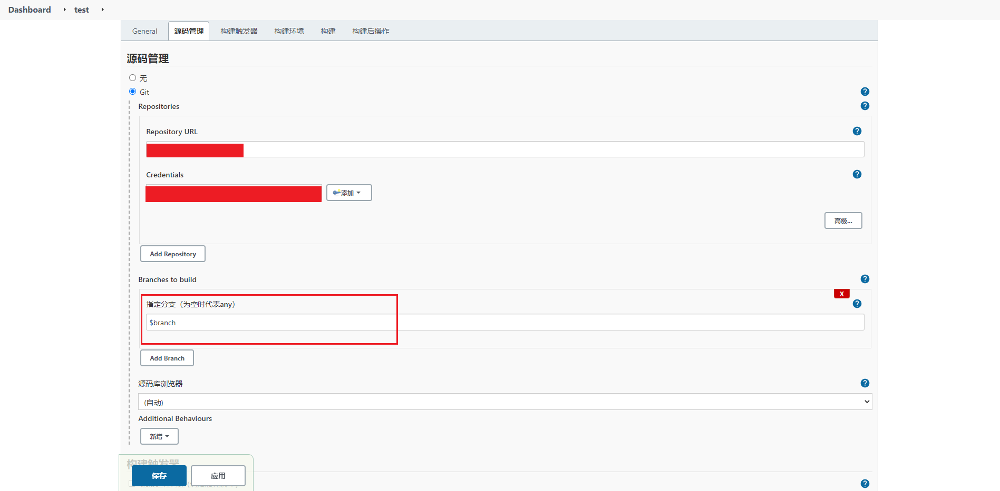

<Boxx/>

## 安装插件

若已安装，请忽略此步骤

进入 `Jenkins` **系统管理(Manage Jenkins)**，点击 **插件管理(Manage Plugins)**，可对插件进行添加和卸载
    

- 安装 NodeJS
    1. 输入 `nodejs`，选中 `NodeJS` ，点击 **Install without restart**
        
    1. 等待安装完成即可
        

- 安装 Git Parameter（非必须）

    配置 Git 参数，可用于获取仓库的分支/标签，进行自定义分支/标签构建

    

- 安装 Generic Webhook Trigger（非必须）

    通用的 Webhook 触发器，配置 Git Webhook 事件，当触发事件时，向 Jenkins 推送请求，可实现提交代码时构建项目的功能

    

- 安装 Build Name and Description Setter（非必须）
    

- 安装 Build Timestamp（非必须）
    


## 配置插件
进入 `Jenkins` **系统管理(Manage Jenkins)**，点击 **全局工具配置(Global Toll Configuration)**


- 配置 NodeJS

    选择 **新增 NodeJS**，配置好版本号以后，点击 **保存** 即可完成设置
    
    

## 新建任务

1. 点击 **新建任务**
    
1. 输入任务名称 `test`，选择 **构建一个自由风格的软件项目**，点击 **确定**（可从已有任务中复制创建）
    

## 添加构建参数（非必须）
:::warning
**注意**：

若需要手动构建，可配置此参数

若使用 WebHook 触发器构建，则无需配置此项
:::

勾选 **参数化构建过程(This project is parameterized)**，在此定义一些参数，在执行shell脚本的时候，可以拿到这些参数来做一些额外的处理


### Git 参数
:::warning
**注意**：必须安装了 `Git Parameter` 插件，才能配置此项
:::
1. 点击 **添加参数**
1. 选择 **Git 参数(Git Parameter)**
1. 填写配置，表示 `Jenkins` 来拉取代码的时候，拉取指定分支的代码，可以通过 `$branch` 来访问变量
    - 变量名称：branch
    - 描述：分支(默认：origin/master)
    - 参数类型：分支
    - 默认值：origin/master


### ENV 配置
1. 点击 **添加参数**
1. 选择 **选项参数**
1. 配置前端项目所属的环境变量选项（选项：每行一个，第一行的将作为默认选项）：
    - `development`: 开发环境
    - `test`: 测试环境
    - `production`: 生产环境（正式）

`ENV` 在前端项目构建时，会当作变量传入，用于动态修改构建的项目环境类型


构建前端资源时，会执行 `npm run build:${传入的环境参数}` 命令。对应的为前端项目 package.json 中各环境的打包命令

```json
{
    "scripts": {
        "build:development": "vue-cli-service build --mode=development",
        "build:test": "vue-cli-service build --mode=test",
        "build:production": "vue-cli-service build --mode=production"
    }
}
```
此处利用了 `vue-cli3.0` 提供的构建命令和环境变量文件，来提供各环境的打包命令。前端项目需要配置多种打包命令，来支持 `Jenkins` 的动态环境构建

## 源码管理


1. 在源码管理选择Git
1. 选择项目代码存放的git地址，输入用户名和密码校验
1. Branches to build 选项根据需要可填写 `$branch`, 这个是上面 **构建参数** 内填写的 **Git 参数** 值，若未设置，可填写分支名称

## 构建触发器（非必须）
::: warning
**注意**:

必须安装了 `Generic Webhook Trigger` 插件，才有此配置选项

配置了构建触发器，则无需配置参数，否则会构建失败
:::


1. 在构建触发器中选择 Generic Webhook Trigger
1. 在 `Token` 栏输入自定义值
1. 我使用的是 Gitea 服务器，所以需要在仓库-> **设置** -> **Web 钩子** 中配置 Url 和 触发条件
    
    

    目标 `URL` 组成是：http://`Jenkins服务器域名或ip`/generic-webhook-trigger/invoke?token=`Jenkins中配置的Token值`
    
    触发条件根据需求选择，我这里选择的是推送事件，分支是 master，当推送代码至 master 分支时，将触发 Jenkins 构建
    
    配置完成后勾选 **激活** 并 **添加 Web 钩子**

1. 在 Web 钩子列表中点击刚才配置的钩子，点击下面的 **测试推送**，可测试推送到 Jenkins
    ::: warning
    **注意**：记得完成 **构建** 步骤 Shell 命令的填写
    :::
    
    

1. 登录 Jenkins，查看此项目已构建成功
    

## 构建


1. 增加构建步骤，选择 **执行 Shell**
1. 根据项目执行步骤添加 **命令**
    ```shell script
    npm install
    npm run build
    
    # 若配置了 ENV 环境变量，可将 build 改为
    npm run build:${ENV}
    ```
