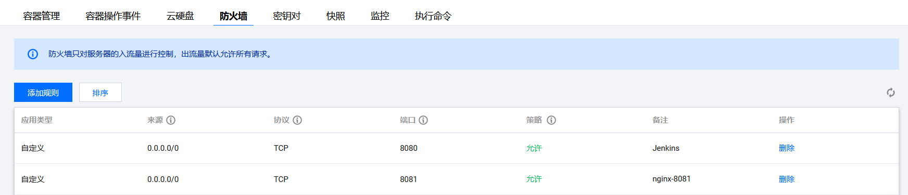
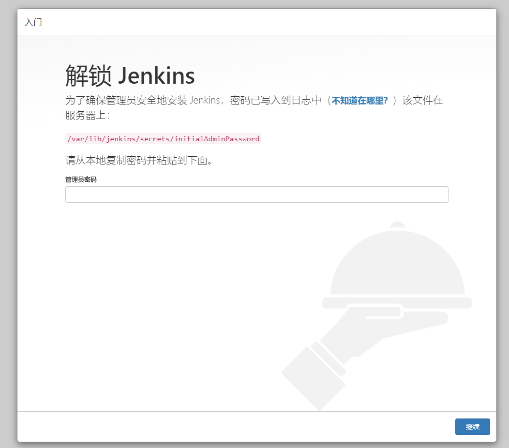
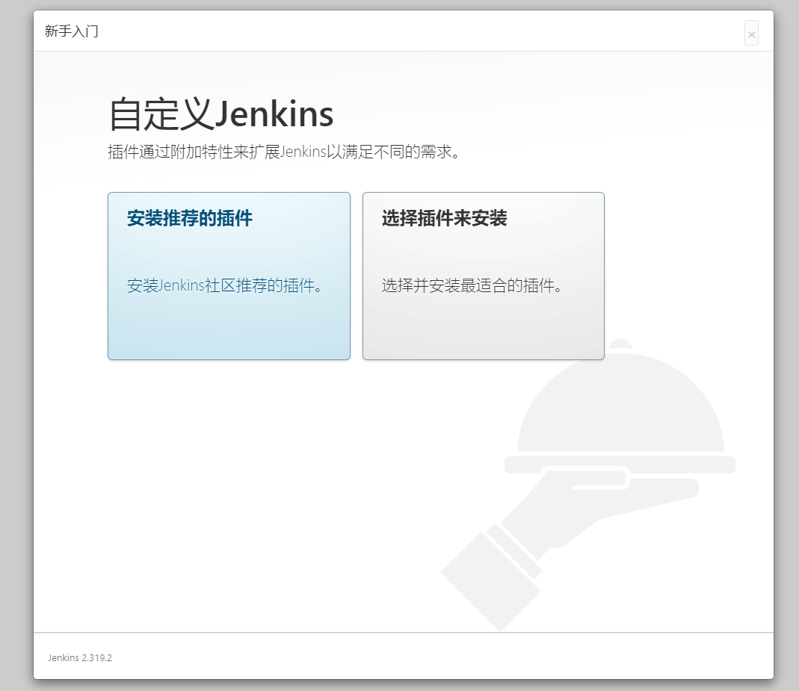
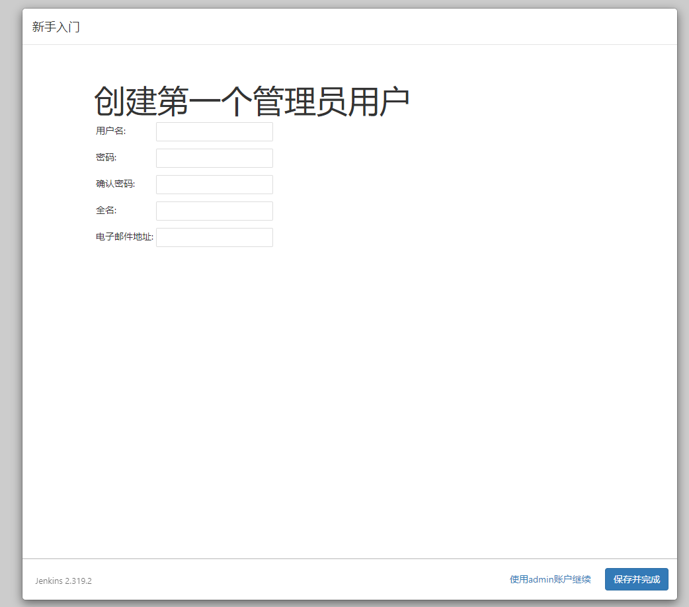
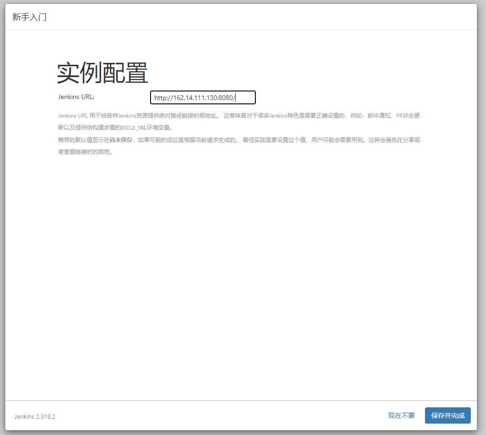
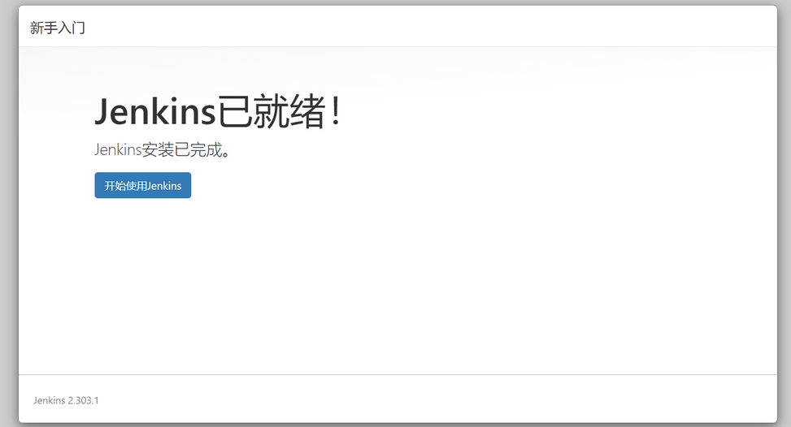

<Boxx/>

## 系统要求

::: tip

官方安装文档地址：<https://www.jenkins.io/zh/doc/book/installing/>

:::

- **最低推荐配置**
    - 256MB可用内存
    - 1GB可用磁盘空间(作为一个Docker容器运行jenkins的话推荐10GB)
- **为小团队推荐的硬件配置**
    - 1GB+可用内存
    - 50 GB+ 可用磁盘空间
- **软件配置**
    - Java 8—无论是Java运行时环境（JRE）还是Java开发工具包（JDK）都可以。

## 系统环境

- 操作系统：Ubuntu Server 20.04 LTS 64bit

- Java版本：jdk1.8（可安装 `openjdk`，因在此需要安装的是 `jdk`）

## 安装 Java jdk

请点击查看 [Java jdk 安装文档](java-install.md)

## 安装 Git

请点击查看 [Git 安装文档](git-install.md)

## 安装 Jenkins
1. 先将秘钥添加到系统（这是 Jenkins 的 Debian 软件包存储库，用于自动安装和升级。要使用此存储库，首先将密钥添加到您的系统）
    ```shell script
    wget -q -O - https://pkg.jenkins.io/debian/jenkins.io.key | sudo apt-key add -
    ```
1. 添加 `jenkins` 存储库到服务器的 `sources.list`
    ```shell script
    sudo sh -c 'echo deb http://pkg.jenkins.io/debian-stable binary/ > /etc/apt/sources.list.d/jenkins.list'
    ```
1. 更新本地包并安装jenkins
    ```shell script
    sudo apt-get update
    sudo apt-get install jenkins
    ````

## 安装报错

### `sudo apt-get update` 报错证书验证失败
错误信息如下：
```shell script
lighthouse@VM-0-5-ubuntu:~$ sudo apt-get update
Hit:1 http://mirrors.tencentyun.com/ubuntu focal InRelease
Hit:2 http://mirrors.tencentyun.com/ubuntu focal-security InRelease                
Hit:3 http://mirrors.tencentyun.com/ubuntu focal-updates InRelease                                 
Ign:4 https://pkg.jenkins.io/debian-stable binary/ InRelease                                       
Hit:5 https://download.docker.com/linux/ubuntu focal InRelease         
Err:6 https://pkg.jenkins.io/debian-stable binary/ Release
  Certificate verification failed: The certificate is NOT trusted. The certificate chain uses expired certificate.  Could not handshake: Error in the certificate verification. [IP: 151.101.74.133 443]
Reading package lists... Done                    
E: The repository 'https://pkg.jenkins.io/debian-stable binary/ Release' does not have a Release file.
N: Updating from such a repository can't be done securely, and is therefore disabled by default.
N: See apt-secure(8) manpage for repository creation and user configuration details.
```

1. 解决方法：重装 `ca-certificates`
```shell script
sudo apt-get install --reinstall ca-certificates
```

1. 重新更新包，并安装
```shell script
sudo apt-get update
sudo apt-get install jenkins
````

### `sudo apt-get install jenkins` 启动找不到 `java` 路径报错
错误信息如下：
```shell script
lighthouse@VM-0-5-ubuntu:~$ sudo apt-get install jenkinsReading package lists... Done
Building dependency tree       
Reading state information... Done
The following additional packages will be installed:
  daemon
The following NEW packages will be installed:
  daemon jenkins
0 upgraded, 2 newly installed, 0 to remove and 256 not upgraded.
Need to get 71.9 MB of archives.
After this operation, 72.6 MB of additional disk space will be used.
Do you want to continue? [Y/n] y
Get:1 http://mirrors.tencentyun.com/ubuntu focal/universe amd64 daemon amd64 0.6.4-1build2 [96.3 kB]
Get:2 https://pkg.jenkins.io/debian-stable binary/ jenkins 2.319.2 [71.8 MB]
Fetched 71.9 MB in 22s (3,219 kB/s)                                                                
Selecting previously unselected package daemon.
(Reading database ... 87032 files and directories currently installed.)
Preparing to unpack .../daemon_0.6.4-1build2_amd64.deb ...
Unpacking daemon (0.6.4-1build2) ...
Selecting previously unselected package jenkins.
Preparing to unpack .../jenkins_2.319.2_all.deb ...
Unpacking jenkins (2.319.2) ...
Setting up daemon (0.6.4-1build2) ...
Setting up jenkins (2.319.2) ...
Job for jenkins.service failed because the control process exited with error code.
See "systemctl status jenkins.service" and "journalctl -xe" for details.
invoke-rc.d: initscript jenkins, action "start" failed.
● jenkins.service - LSB: Start Jenkins at boot time
     Loaded: loaded (/etc/init.d/jenkins; generated)
     Active: failed (Result: exit-code) since Wed 2022-01-19 16:54:20 CST; 7ms ago
       Docs: man:systemd-sysv-generator(8)
    Process: 2721745 ExecStart=/etc/init.d/jenkins start (code=exited, status=1/FAILURE)

Jan 19 16:54:20 VM-0-5-ubuntu systemd[1]: Starting LSB: Start Jenkins at boot time...
Jan 19 16:54:20 VM-0-5-ubuntu jenkins[2721745]: ERROR: No Java executable found in current PATH: /bin:/usr/bin:/sbin:/usr/sbin
Jan 19 16:54:20 VM-0-5-ubuntu jenkins[2721745]: If you actually have java installed on the system make sure the executable is in the aforementioned path and that 'type -p java' returns the java executable path
Jan 19 16:54:20 VM-0-5-ubuntu systemd[1]: jenkins.service: Control process exited, code=exited, status=1/FAILURE
Jan 19 16:54:20 VM-0-5-ubuntu systemd[1]: jenkins.service: Failed with result 'exit-code'.
Jan 19 16:54:20 VM-0-5-ubuntu systemd[1]: Failed to start LSB: Start Jenkins at boot time.
dpkg: error processing package jenkins (--configure):
 installed jenkins package post-installation script subprocess returned error exit status 1
Processing triggers for man-db (2.9.1-1) ...
Processing triggers for systemd (245.4-4ubuntu3.1) ...
Errors were encountered while processing:
 jenkins
E: Sub-process /usr/bin/dpkg returned an error code (1)
```

1. 输入以下命令查看 `java` 路径
    ```shell script
    lighthouse@VM-0-5-ubuntu:~$ type -p java
    /usr/lib/java/jdk1.8.0_321/bin/java
    ```
   
1. 方法一：建立java软连接（推荐使用此方法）
    ```shell script
    sudo ln -s /usr/lib/java/jdk1.8.0_321/bin/java /usr/bin/java
    ```
   
    方法二：编辑配置文件，并保存
    ```shell script
    lighthouse@VM-0-5-ubuntu:~$ sudo vim /etc/init.d/jenkins
    
    # 找到以下配置，将 JAVA 值改为以上步骤的返回值
    #JAVA=`type -p java`
    JAVA=/usr/lib/java/jdk1.8.0_321/bin/java
    ```

1. 重启
    ```shell script
    systemctl restart jenkins.service
    ```

1. 查看状态
    ```shell script
    lighthouse@VM-0-5-ubuntu:~$ systemctl status jenkins.service
    ● jenkins.service - LSB: Start Jenkins at boot time
         Loaded: loaded (/etc/init.d/jenkins; generated)
         Active: active (exited) since Wed 2022-01-19 17:22:38 CST; 1min 16s ago
           Docs: man:systemd-sysv-generator(8)
        Process: 2727114 ExecStart=/etc/init.d/jenkins start (code=exited, status=0/SUCCESS)
    lighthouse@VM-0-5-ubuntu:~$ 
    ```

## 访问 Jenkins
::: tip
默认端口 `8080`
:::

1. 因我使用的是腾讯云服务器，需要添加防火墙规则，如下所示：
    

1. 使用 `ip:端口` 访问
    
    
    ```shell script
    sudo vim /var/lib/jenkins/secrets/initialAdminPassword
    ```
   
   将密码复制到文本框中，点击继续

1. 安装插件，我选择的是安装推荐的插件
    

1. 创建管理员
    
    
1. 实例配置
    

1. 完成
    
